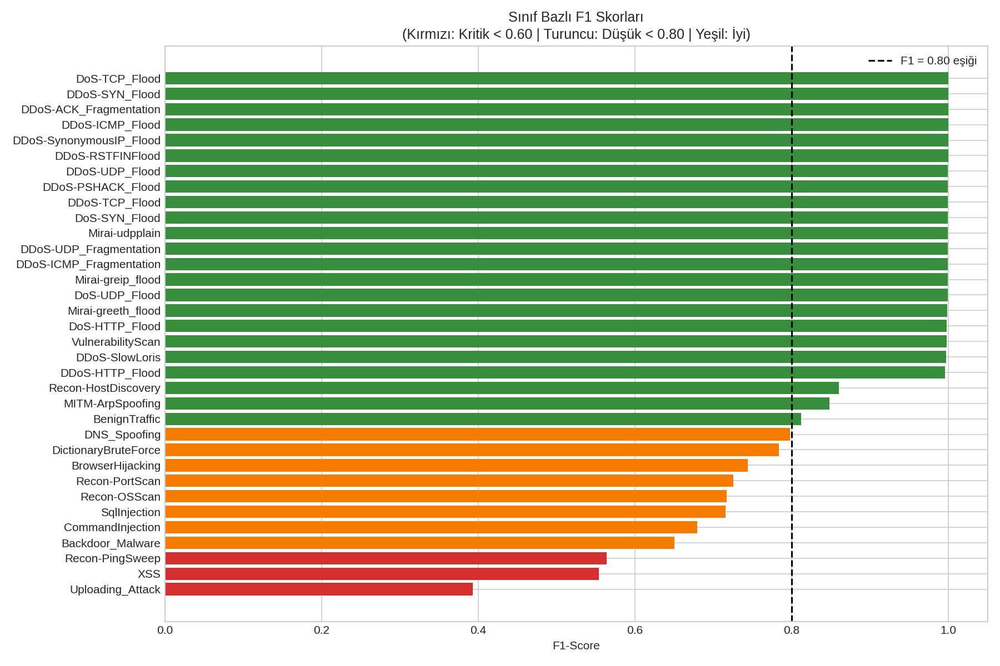

# IoT Intrusion Detection System
### CICIoT2023 Dataset | XGBoost | Streamlit

A machine learning-based intrusion detection system (IDS) for IoT networks, 
trained on the CICIoT2023 dataset. The system detects 34 attack types across 
7 categories from network traffic (.pcap files).

## Results

| Metric | Value |
|--------|-------|
| Accuracy | 0.92 |
| Macro F1-Score | 0.8845 |
| Weighted F1-Score | 0.919 |
| CV Accuracy (5-Fold) | 0.9193 ± 0.0009 |
| CV Macro F1 (5-Fold) | 0.8845 ± 0.0016 |
| Training Time | ~24 seconds (GPU T4) |
| Features | 51 (46 original + 5 engineered) |
| Attack Classes | 34 (33 attacks + benign) |

## Feature Engineering

5 flow-level features derived from existing network statistics:

| Feature | Formula | Captures |
|---------|---------|---------|
| `bytes_per_packet` | Tot size / (Number + 1) | Payload size pattern |
| `packet_rate` | Number / (flow_duration + 1) | Traffic intensity |
| `flag_ratio` | (SYN+FIN+RST+PSH flags) / (Number + 1) | Aggressive behavior |
| `syn_fin_ratio` | syn_count / (fin_count + 1) | Half-open connections |
| `payload_ratio` | AVG / (Max + 1) | Packet size consistency |

> Note: `flow_duration == 0` rows (~32% of data) are structurally expected 
> in flood/fragmentation attacks. +1 smoothing applied to prevent division by zero.

## Attack Categories Detected

| Category | Examples |
|----------|---------|
| DDoS | ICMP Flood, SYN Flood, UDP Flood, SlowLoris |
| DoS | TCP Flood, HTTP Flood, SYN Flood |
| Mirai | Greeth Flood, Greip Flood, UDPPlain |
| Recon | Port Scan, OS Scan, Host Discovery |
| Spoofing | ARP Spoofing, DNS Spoofing |
| Brute Force | Dictionary Attack |
| Web-Based | XSS, SQL Injection, Command Injection, Backdoor |

## Per-Class Performance

Model performance varies significantly by attack type:

- **High F1 (>0.99):** DDoS, DoS, Mirai variants — high-volume, pattern-distinct attacks
- **Medium F1 (0.80–0.99):** Recon, Spoofing, BenignTraffic
- **Low F1 (<0.80):** Web-based attacks and rare classes

Critical classes (F1 < 0.80): `Uploading_Attack` (0.39), `XSS` (0.55), 
`Recon-PingSweep` (0.56), `Backdoor_Malware` (0.65)



## Dataset

**CICIoT2023** — Canadian Institute for Cybersecurity
- 105 real IoT devices
- 33 attack types
- 46 network flow features (+ 5 engineered)
- ~46M total records

Stratified sampling applied: 10,000 samples per class, 297,091 total records.  
Train/test split: 80/20 stratified — class proportions preserved across splits.

## How It Works

PCAP File → Feature Extraction (Scapy) → StandardScaler → XGBoost → Results

1. Upload a `.pcap` file
2. Scapy parses packets into 51-feature windows
3. XGBoost classifies each window
4. Results shown with attack categories and defense recommendations
5. PDF report download available

## Installation

```bash
git clone https://github.com/yunus54yunus/iot-ids-ciciot2023.git
cd iot-ids-ciciot2023
pip install -r requirements.txt
streamlit run app.py
```

## Project Structure
iot-ids-ciciot2023/
├── app.py                  # Streamlit web application
├── requirements.txt
├── assets/
│   └── per_class_f1.png    # Per-class F1 visualization
├── model/
│   ├── xgb_model.json      # Trained XGBoost model
│   ├── scaler.pkl          # StandardScaler
│   └── label_encoder.pkl   # LabelEncoder
└── utils/
└── pcap_parser.py      # PCAP feature extraction


## Limitations

- PCAP feature mapping is approximate — not all CICIoT2023 features can be 
  directly extracted from raw packets
- Web-based attack classes (XSS, SQLi, Uploading) show lower F1 scores due 
  to limited training samples and feature overlap with benign traffic
- Low-sample classes (<500 examples) have limited generalization capacity
- Confidence scores on real traffic may differ from dataset evaluation metrics

## References

- Neto et al., "CICIoT2023: A real-time dataset and benchmark for large-scale 
  attacks in IoT environment", Sensors, 2023
- Chen & Guestrin, "XGBoost: A Scalable Tree Boosting System", KDD 2016
